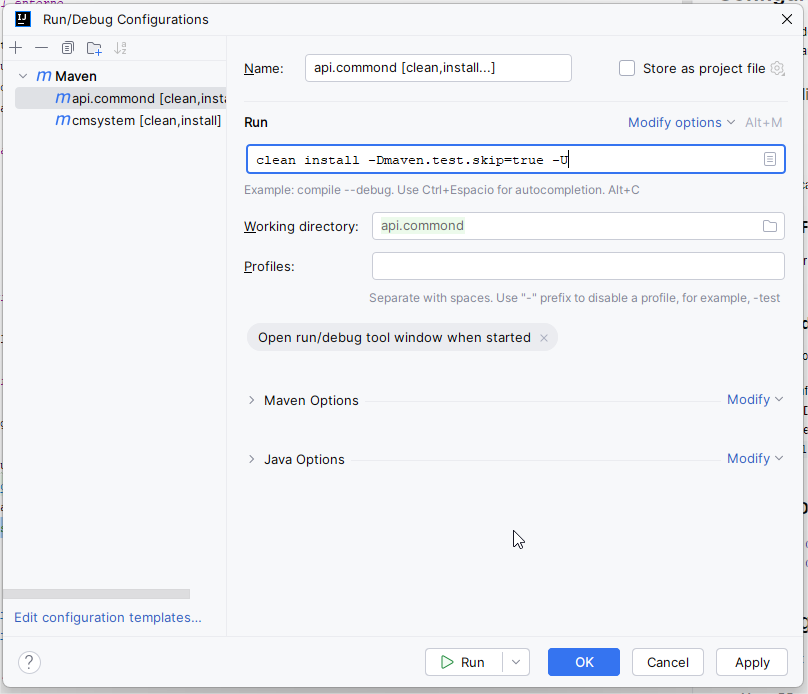

# CMSYSTEM API COMMON

Esta librería contiene las clases comunes que se utilizan en las API de los microservicios de CMSYSTEM.

## Configuracion del entorno

IDE recomendado: IntelliJ IDEA.
Se tiene que configurar el proyecto con el JDK 17.
Se utilizará el encoding UTF-8 para los archivos de propiedades y consola.
También utilizará la base de datos de PostgreSQL.

### Plugin a utilizar:

- Copilot
- Lombok
- SonarLint
- Smart Tomcat

### Configurar Plugin Lombok

Hay que habilitar el plugin de Lombok en IntelliJ IDEA. Esta opción se mostrar al momento de la compilación.

### Configurar de arranque de aplicación (Run/Debug Configuration)

Hay que crear configurar la compilacion de Maven para que se ejecute la aplicación:

- **Maven**: configuracion de tipo Maven
    - 
    - Hay que indicarle el comando de arranque de la aplicación. En este caso, el comando
      es: `clean install -Dmaven.test.skip=true -U`

## Repositorio GIT

- [Repositorio GIT - Github](https://github.com/cimacg22/cmsystem.backend.git)

## Tecnologías base:

- Spring Boot
- Spring Boot Data JPA
- PostgreSQL

## Dependencias

- Java 17
- Spring Boot 3.3.1
- spring-boot-starter-test
- spring-boot-starter-security
- lombok

```xml

<dependencies>
    <!-- spring Test -->
    <dependency>
        <groupId>org.springframework.boot</groupId>
        <artifactId>spring-boot-starter-test</artifactId>
        <scope>test</scope>
    </dependency>
    <!-- Spring Security -->
    <dependency>
        <groupId>org.springframework.boot</groupId>
        <artifactId>spring-boot-starter-security</artifactId>
    </dependency>
    <!-- lombok -->
    <dependency>
        <groupId>org.projectlombok</groupId>
        <artifactId>lombok</artifactId>
    </dependency>
</dependencies>
```

El starter debe activarse con la siguiente propiedad de configuración:

```yaml
spring:
  application:
    name: api.commond
  datasource:
    url: jdbc:postgresql://${PGSQL_SERVICE_HOST}:${PGSQL_SERVICE_PORT}/database
    username: dbuser
    password: dbpass
    driver-class-name: org.postgresql.Driver
```

## Parametrización o variables de entorno

### Formato para descriptor de Docker compose

```yaml
- env:
    # Configuracion del servidor Base de datos - Mongo DB
    - name: PGSQL_SERVICE_HOST
      value: localhost
    - name: PGSQL_SERVICE_PORT
      value: 5432
```

### Formato de archivo de propiedades

```properties
# Configuracion del servidor Base de datos - Mongo DB
PGSQL_SERVICE_HOST=localhost
PGSQL_SERVICE_PORT=5432
```
